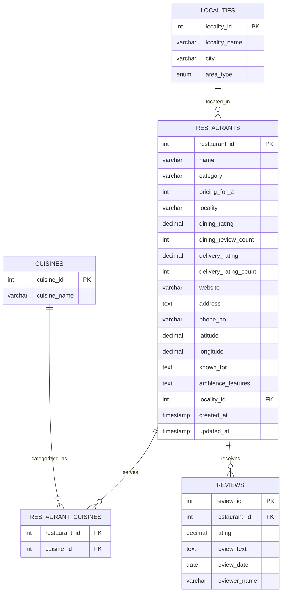

# Entity-Relationship Diagram: Zomato NCR Restaurant Database

## Database Schema: restaurant_db

This document provides the Entity-Relationship (ER) diagram for the Zomato NCR Restaurant Database Management System.

## ER Diagram (Mermaid Format)



## Detailed Entity Descriptions

### 1. RESTAURANTS (Main Entity)
**Purpose**: Central entity storing all restaurant information
- **Primary Key**: restaurant_id (Auto-increment)
- **Foreign Keys**: locality_id → LOCALITIES(locality_id)
- **Attributes**:
  - Basic Info: name, category, website, address, phone_no
  - Location: latitude, longitude, locality
  - Pricing: pricing_for_2
  - Ratings: dining_rating, dining_review_count, delivery_rating, delivery_rating_count
  - Features: known_for, ambience_features
  - Timestamps: created_at, updated_at

### 2. CUISINES (Lookup Entity)
**Purpose**: Normalized storage of cuisine types
- **Primary Key**: cuisine_id (Auto-increment)
- **Attributes**:
  - cuisine_name (Unique constraint)
- **Relationship**: Many-to-Many with RESTAURANTS via RESTAURANT_CUISINES

### 3. LOCALITIES (Geographic Entity)
**Purpose**: Geographic and administrative information
- **Primary Key**: locality_id (Auto-increment)
- **Attributes**:
  - locality_name (Unique constraint)
  - city
  - area_type (ENUM: 'Central', 'Suburban', 'Commercial', 'Residential')
- **Relationship**: One-to-Many with RESTAURANTS

### 4. RESTAURANT_CUISINES (Junction Entity)
**Purpose**: Many-to-Many relationship between Restaurants and Cuisines
- **Composite Primary Key**: (restaurant_id, cuisine_id)
- **Foreign Keys**: 
  - restaurant_id → RESTAURANTS(restaurant_id)
  - cuisine_id → CUISINES(cuisine_id)

### 5. REVIEWS (Transaction Entity)
**Purpose**: Customer reviews and ratings (Future expansion)
- **Primary Key**: review_id (Auto-increment)
- **Foreign Keys**: restaurant_id → RESTAURANTS(restaurant_id)
- **Attributes**:
  - rating, review_text, review_date, reviewer_name

## Relationships Summary

| Relationship | Type | Description |
|--------------|------|-------------|
| RESTAURANTS ↔ CUISINES | Many-to-Many | A restaurant can serve multiple cuisines, a cuisine can be served by multiple restaurants |
| LOCALITIES → RESTAURANTS | One-to-Many | A locality can have multiple restaurants, a restaurant belongs to one locality |
| RESTAURANTS → REVIEWS | One-to-Many | A restaurant can have multiple reviews, a review belongs to one restaurant |

## Normalization Level: 3NF (Third Normal Form)

### 1NF Compliance:
- ✅ All attributes contain atomic values
- ✅ No repeating groups
- ✅ Each row is unique (Primary keys defined)

### 2NF Compliance:
- ✅ All non-key attributes fully depend on primary keys
- ✅ No partial dependencies

### 3NF Compliance:
- ✅ No transitive dependencies
- ✅ Cuisines normalized into separate table
- ✅ Localities normalized into separate table

## Database Constraints

### Primary Key Constraints:
```sql
-- Auto-incrementing primary keys
restaurant_id (RESTAURANTS)
cuisine_id (CUISINES)
locality_id (LOCALITIES)
review_id (REVIEWS)

-- Composite primary key
(restaurant_id, cuisine_id) (RESTAURANT_CUISINES)
```

### Foreign Key Constraints:
```sql
-- Referential integrity maintained
RESTAURANTS.locality_id → LOCALITIES.locality_id
RESTAURANT_CUISINES.restaurant_id → RESTAURANTS.restaurant_id
RESTAURANT_CUISINES.cuisine_id → CUISINES.cuisine_id
REVIEWS.restaurant_id → RESTAURANTS.restaurant_id
```

### Unique Constraints:
```sql
-- Prevent duplicates
CUISINES.cuisine_name (UNIQUE)
LOCALITIES.locality_name (UNIQUE)
```

### Check Constraints:
```sql
-- Data validation
dining_rating BETWEEN 0.0 AND 5.0
delivery_rating BETWEEN 0.0 AND 5.0
pricing_for_2 > 0
area_type IN ('Central', 'Suburban', 'Commercial', 'Residential')
```

## Indexing Strategy

### Primary Indexes:
- All primary keys automatically indexed

### Secondary Indexes:
```sql
-- Performance optimization
CREATE INDEX idx_restaurant_rating ON RESTAURANTS(dining_rating);
CREATE INDEX idx_restaurant_locality ON RESTAURANTS(locality);
CREATE INDEX idx_restaurant_pricing ON RESTAURANTS(pricing_for_2);
CREATE INDEX idx_restaurant_city ON RESTAURANTS(city);
CREATE INDEX idx_locality_city ON LOCALITIES(city);
```

## Data Flow Diagram

```
CSV Data → Temporary Table → Data Processing → Normalized Tables
    ↓
1. Extract unique cuisines → CUISINES table
2. Extract unique localities → LOCALITIES table  
3. Insert restaurants with foreign keys → RESTAURANTS table
4. Create cuisine mappings → RESTAURANT_CUISINES table
5. Future: Customer reviews → REVIEWS table
```

## Business Rules Implemented

1. **Restaurant Uniqueness**: Each restaurant has a unique ID
2. **Cuisine Normalization**: Cuisines stored once, referenced multiple times
3. **Geographic Hierarchy**: Localities grouped by city and area type
4. **Rating Validation**: Ratings constrained between 0.0 and 5.0
5. **Referential Integrity**: All foreign key relationships enforced
6. **Data Consistency**: Timestamps track creation and modification

## Query Optimization Considerations

### Efficient Joins:
- Proper indexing on join columns
- Foreign key relationships optimize query planning
- Composite indexes for multi-column searches

### Aggregation Performance:
- Indexes on frequently aggregated columns (rating, pricing)
- Materialized views for complex analytics (future enhancement)

### Scalability Features:
- Normalized design reduces storage overhead
- Modular structure supports horizontal scaling
- Separate tables allow independent optimization

---

**Note**: This ER diagram represents the current implementation. Future enhancements may include additional entities for menu items, delivery zones, user profiles, and real-time analytics tables.